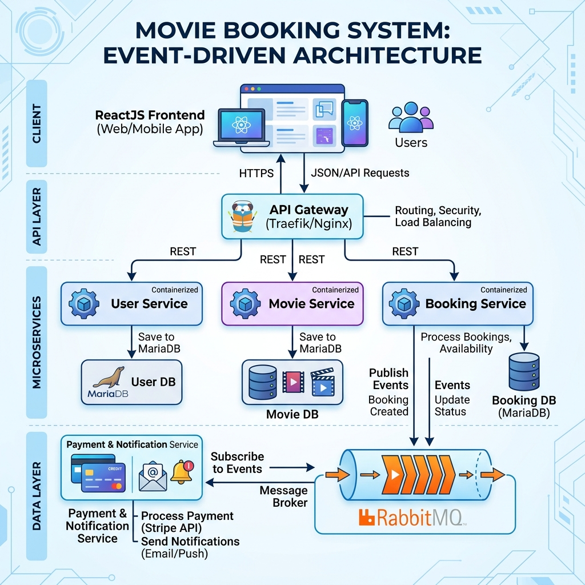

# Tuần 08: Kiến trúc Hướng sự kiện (Event-Driven Architecture) - Hệ thống Đặt vé Xem phim

## 1. Giới thiệu
Hệ thống được thiết kế theo kiến trúc **Event-Driven Architecture (EDA)** nhằm đảm bảo tính bất đồng bộ (asynchronous), khả năng mở rộng (scalability) và giảm sự phụ thuộc trực tiếp (decoupling) giữa các dịch vụ trong một hệ thống đặt vé xem phim trực tuyến.

## 2. Kiến trúc Hệ thống
Hệ thống bao gồm các microservices chính:
- **API Gateway**: Cổng vào duy nhất (Single Entry Point), điều hướng request và quản lý routing.
- **User Service**: Quản lý thông tin người dùng, hồ sơ và xác thực.
- **Movie Service**: Quản lý danh mục phim, danh sách lịch chiếu, thông tin phòng vé và ghế ngồi.
- **Booking Service**: Xử lý nghiệp vụ đặt vé chính. Đây là thành phần quan trọng nhất đóng vai trò là **Producer** (người phát tin) trong mô hình EDA.
- **Payment & Notification Service**: Thành phần đóng vai trò là **Consumer** (người nhận tin). Nó lắng nghe các sự kiện đặt vé để xử lý các tác vụ hậu kỳ như thanh toán và gửi thông báo.

## 3. Quy trình hoạt động (Workflow)
1. **Khám phá**: Người dùng xem danh sách phim và lịch chiếu qua **Movie Service**.
2. **Đặt vé**: Người dùng thực hiện đặt vé qua **Booking Service**.
3. **Xử lý đồng bộ**: **Booking Service** kiểm tra tính hợp lệ, lưu thông tin đặt vé vào Database (MariaDB) với trạng thái tạm thời.
4. **Phát sự kiện**: Ngay sau khi lưu DB, **Booking Service** gửi một message chứa thông tin đặt vé vào **RabbitMQ** (Exchange/Queue).
5. **Xử lý bất đồng bộ**: **Payment & Notification Service** tự động nhận message từ RabbitMQ. Nó sẽ:
   - Thực hiện quy trình thanh toán (giả lập).
   - Gửi email xác nhận hoặc thông báo đẩy cho người dùng.
   - Cập nhật lại trạng thái đơn hàng nếu cần.

## 4. Sơ đồ Kiến trúc

## 5. Công nghệ sử dụng
- **Backend Framework**: Spring Boot 3.x
- **Messaging Broker**: RabbitMQ (AMQP)
- **Database**: MariaDB (Lưu trữ quan hệ cho User, Movie, Booking)
- **Communication**: 
    - REST API (Giữa Frontend và Gateway/Services).
    - RabbitMQ (Giao tiếp bất đồng bộ giữa Booking và Payment).
- **Thư viện hỗ trợ**: Lombok, Spring Data JPA, Validation.

## 6. Hướng dẫn chạy hệ thống
1. Đảm bảo đã cài đặt **RabbitMQ** và **MariaDB**.
2. Khởi chạy các service theo thứ tự:
    - RabbitMQ & DB
    - API Gateway
    - Các microservices (User, Movie, Booking)
    - Payment & Notification Service
    - Frontend
3. Truy cập Frontend để trải nghiệm luồng đặt vé.
