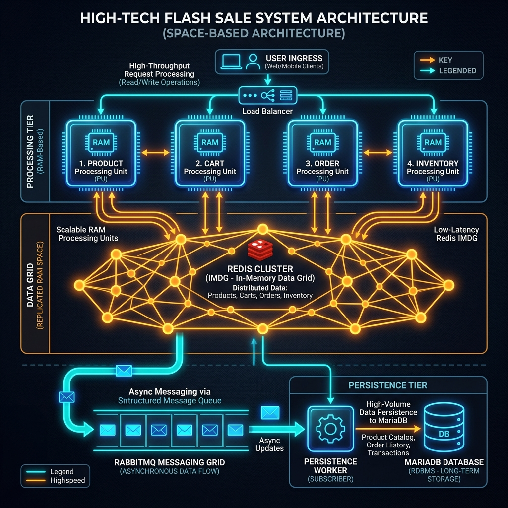

# Tuần 09: Kiến trúc Dựa trên không gian (Space-Based Architecture) - Hệ thống Flash Sale

## 1. Giới thiệu
Kiến trúc **Space-Based Architecture (SBA)** được áp dụng để giải quyết thách thức về khả năng mở rộng cực hạn (Extreme Scalability) trong các hệ thống Flash Sale. SBA giúp loại bỏ hiện tượng "nghẽn cổ chai" tại Database bằng cách chuyển dịch trọng tâm xử lý từ đĩa cứng lên bộ nhớ RAM.

## 2. Nguyên lý hoạt động
Hệ thống không tương tác trực tiếp với Database trong các luồng giao dịch nóng (hot paths). Toàn bộ dữ liệu cần thiết (sản phẩm, tồn kho, giỏ hàng) được lưu trữ trong một **Shared Space (Data Grid)**.

## 3. Các thành phần chính
### A. Processing Units (PUs)
Đây là các đơn vị xử lý nghiệp vụ, hoạt động hoàn toàn trên RAM:
- **Product PU**: Cung cấp thông tin sản phẩm từ Data Grid.
- **Cart PU**: Quản lý giỏ hàng của người dùng, đảm bảo tốc độ phản hồi < 10ms.
- **Order PU**: Tiếp nhận yêu cầu đặt hàng, tạo đơn hàng trên RAM.
- **Inventory PU**: Quan trọng nhất, thực hiện trừ tồn kho ngay lập tức trên RAM để ngăn chặn bán quá số lượng (Overselling).

### B. Virtualized Middleware
- **Data Grid (Redis)**: Đóng vai trò là "Không gian" (Space) chung, nơi các PUs đọc/ghi dữ liệu.
- **Messaging Grid (RabbitMQ)**: Kênh vận chuyển các thay đổi dữ liệu từ Space về phía Database.

### C. Data Persistence Layer
- **Persistence Worker (Write)**: Lắng nghe các sự kiện `order_created` từ RabbitMQ và thực hiện ghi xuống Database (MariaDB) theo cơ chế **Write-behind**.
- **Data Pump (Read)**: Khi hệ thống khởi động (Warm-up), component này sẽ nạp dữ liệu từ Database lên Redis để sẵn sàng phục vụ.

## 4. Sơ đồ Kiến trúc

## 5. Ưu điểm của kiến trúc này
- **Hiệu năng cực cao**: Xử lý hàng nghìn đơn hàng mỗi giây nhờ RAM.
- **Tính sẵn sàng**: Các PUs có thể scale-out dễ dàng mà không làm quá tải DB.
- **Trải nghiệm người dùng**: Khách hàng nhận được kết quả "Đặt hàng thành công" ngay lập tức mà không cần chờ DB xác nhận.

## 6. Công nghệ sử dụng
- **In-memory Grid**: Redis
- **Message Broker**: RabbitMQ
- **Backend**: Spring Boot, Spring Cloud OpenFeign (Service-to-service communication)
- **Load Testing**: k6 (Dùng để kiểm chứng khả năng chịu tải của hệ thống)

## 7. Kiểm thử hiệu năng (k6)
Hệ thống đi kèm với các kịch bản test k6 để mô phỏng 1000+ người dùng đồng thời thực hiện add-to-cart và checkout, chứng minh tính hiệu quả của Space-Based Architecture.
